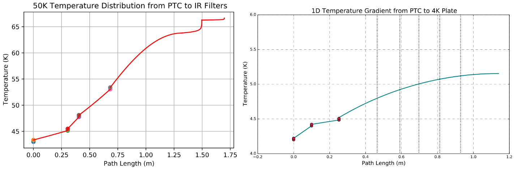
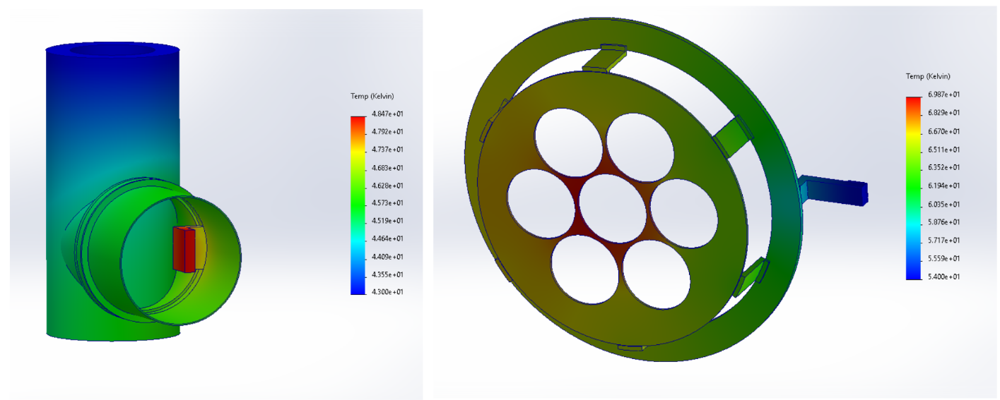
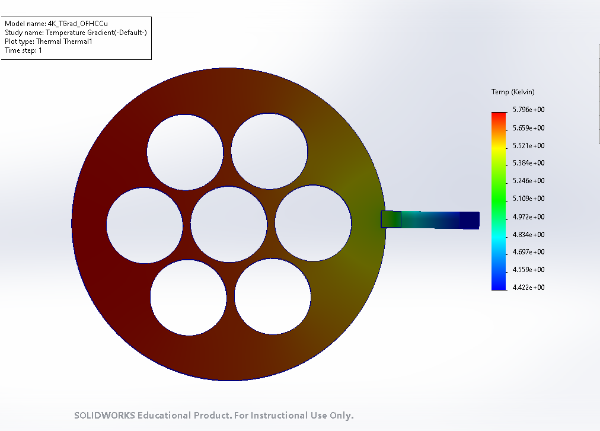

# Thermal-Gradient-Analysis-of-SPT-4-Cryostat
Assessment of thermal gradient across conductive pathways from Pulse Tube Cryo-cooler to key internal subassemblies. I needed to verify that the temperatures were within the dynamic range for the optics to function. The highest temperature for the 50 Kelvin subassembly was spec'd to be 65 Kelvin, which is the trade-off point for the alumina infrared filters to emit significant optical loading onto the focal plane. The 4 Kelvin assembly contains the mounting for all seven of the optics tubes, whose silicon lenses cannot be hotter than 8 Kelvin. Silicon transitions from a lens to a hot blackbody near 10 Kelvin (and therefore must be cold). 

I performed static thermal finite element analyses of each subassembly with temperature-dependent material properties. I corroborated these FEAs using 1D numerical calculations defined in the attached Python code, whose predictions were within 12% of the FEA results. Both numerical and FEA show that these two subassemblies meet these thermal requirements under circumstance of the heat load and Cryomech PT420 cryo-cooler. 

## My Role:
- performed both analytic and finite element analyses to evaluate thermal gradients across the 50 Kelvin and 4 Kelvin subassemblies
- developed Python code bases to perform analytic calculations with varying design geometry and material properties

## Temperature constraints:
- The highest temperature of the 50 Kelvin subassembly is 65 Kelvin, set by the alumina infrared filters
- The highest temperature of the 4 Kelvin subassembly is 8 Kelvin, set by the silicon lenses

## Notes and Assumptions:
- material properties from [NIST database](https://trc.nist.gov/cryogenics/materials/materialproperties.htm)
- contact resistance of OFHC copper: Siddappa, P., & Tariq, A. 2023, Applied Thermal Engineering, 219, 119412, doi: https://doi.org/10.1016/j.applthermaleng.2022.119412
- SPT-3G empirically showed braided OFHC copper heat straps have a load-dependent temperature drop of ~0.12 K/W for 2"x2" footprints
- PT420 cold head temperatures (see [Thermal Budget](https://github.com/ahryciuk/Thermal-Budgeting-of-SPT-4-Cryostat)): https://cdn.bluefors.com/wp-content/uploads/2023/09/22145601/PT420-RM-Capacity-Curve.pdf
- heat generation from optics tubes based on lens absorption is ~30 mW per tube
- heat generation from alumina filters is ~1.2 W per tube (see [Thermal Budget](https://github.com/ahryciuk/Thermal-Budgeting-of-SPT-4-Cryostat)) 

## Summary of Results:

Thermal Gradients by Subassembly (units in Kelvin)
| 50 Kelvin (1D) | 50 Kelvin (FEA) | 4 Kelvin (1D) | 4 Kelvin (FEA) | Optics Tube Spread (Al1100) | Optics Tube Spread (OFHC Cu) |
|:-------:|:-------:|:-------:|:-------:|:-------:|:-------:|
| 19.7 | 18.12 | 4.14 | 4.61 | 1.88 | 0.24 |

1D temperature results

50 Kelvin subassembly FEA

4 Kelvin subassembly FEA

## Files:
- CAD renders: /renders/
- Summary plots: /summary_plots/
- Analysis document: SPT4_Cryostat_Temperature_Gradient_Characterization.pdf
- Python code: /python_code/
- Focal plane analysis: /focal_plane_thermal_bus/
